# AuraCredit: Shielded Undercollateralized DeFi Lending 💳


## Desktop and mobile walkthrough

Fresh captures of this build at 1440 × 1000 and 390 × 844. Wallet disconnected; no credentials entered. These images document the interface, not transaction finality.

<details>
<summary>View every page at both screen sizes</summary>

| Page | Desktop | Mobile |
| --- | --- | --- |
| home | 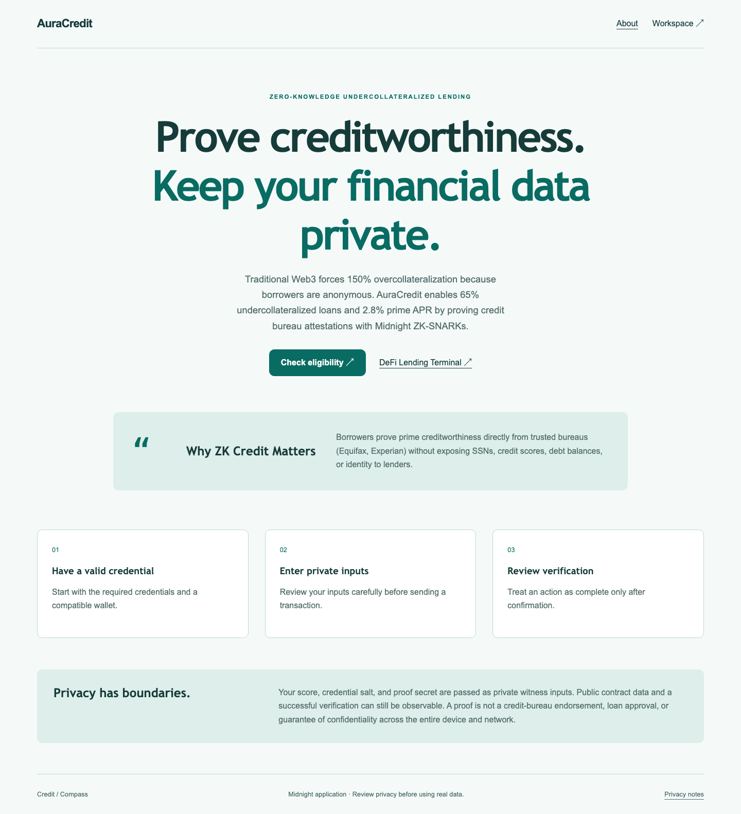 | 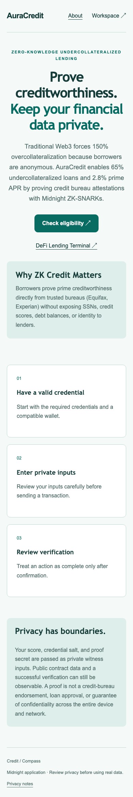 |
| dashboard | 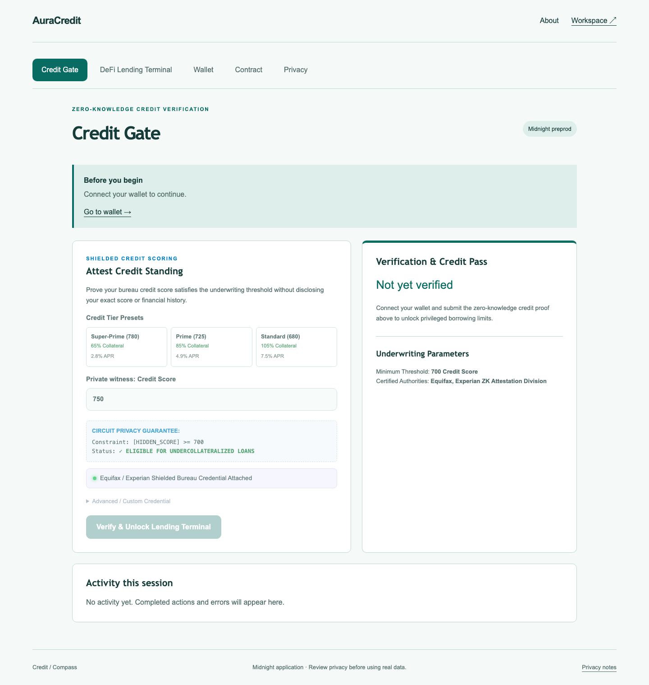 | 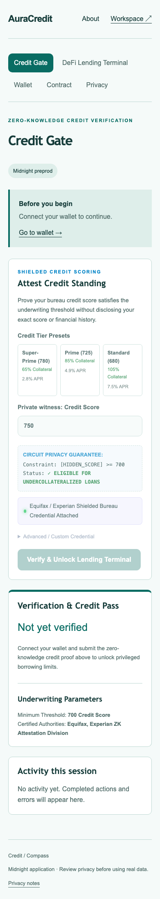 |
| lending | 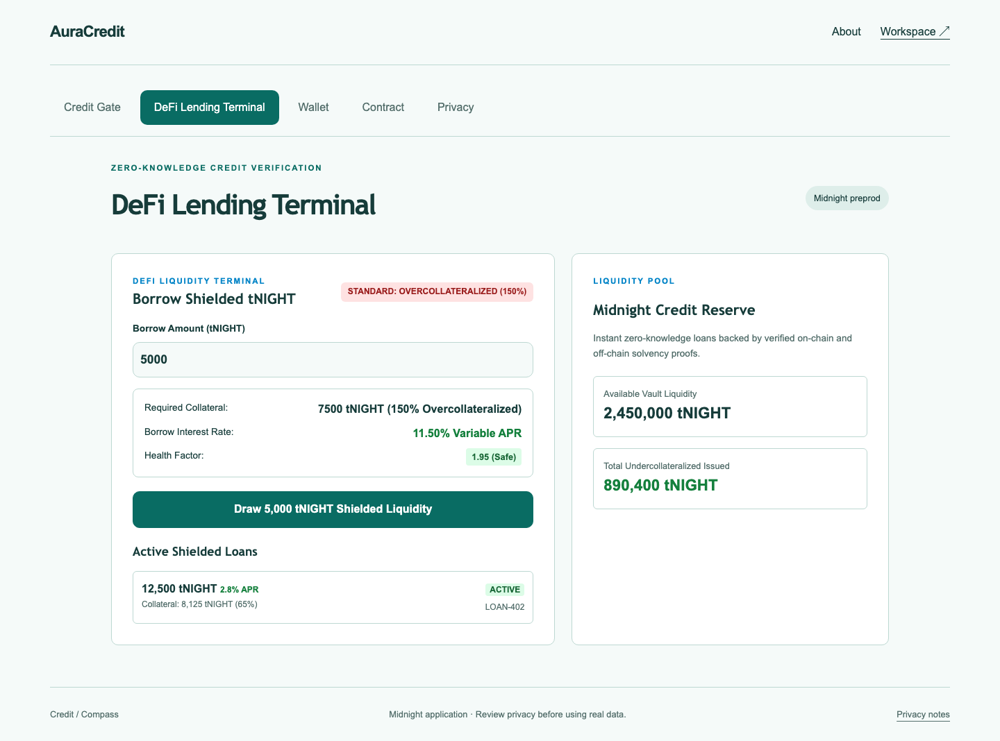 | 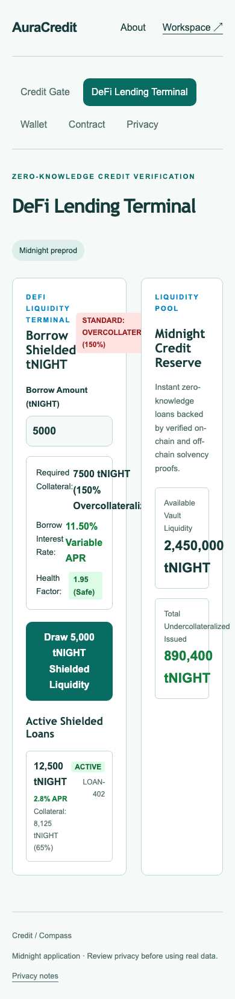 |
| privacy | 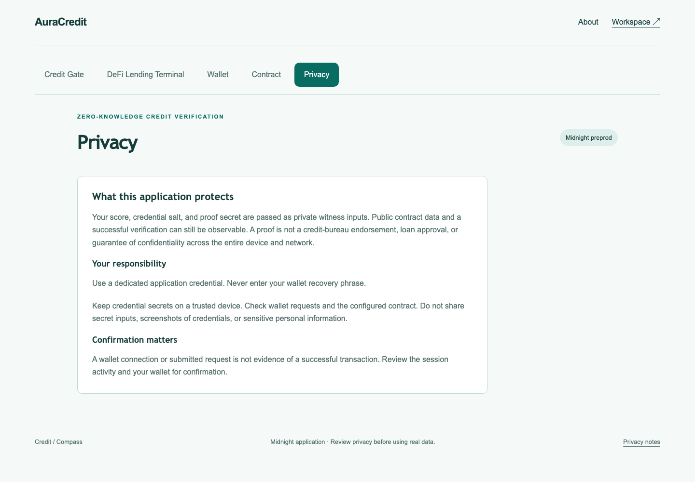 | 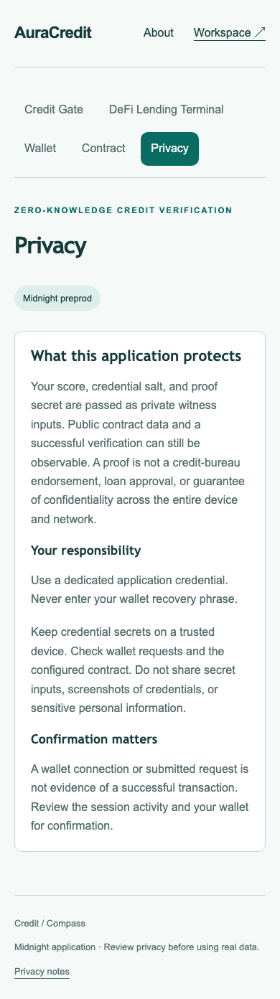 |
| walletHub | 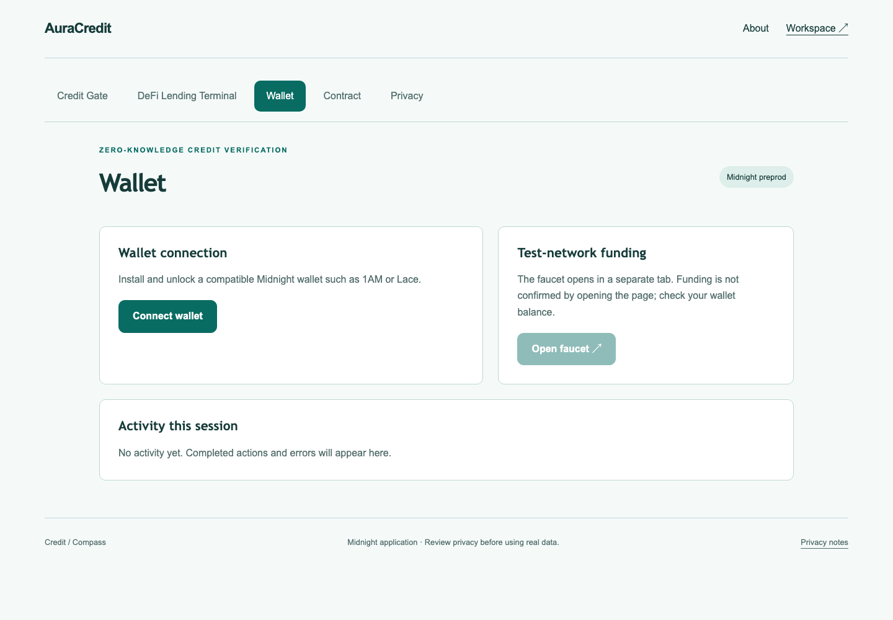 | 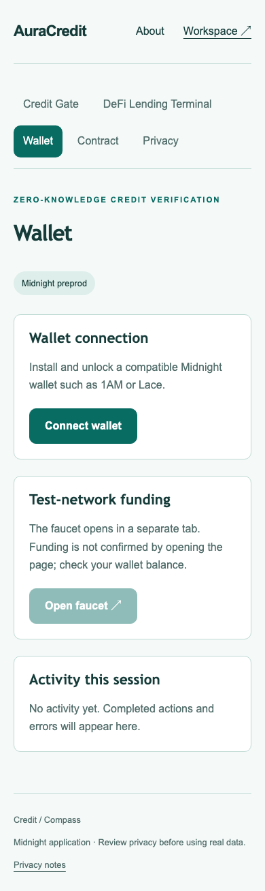 |
| deployer | 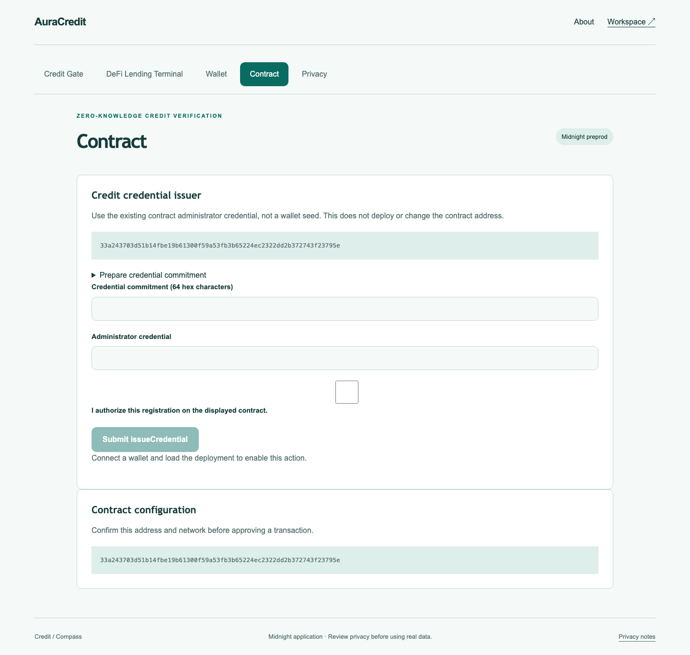 | 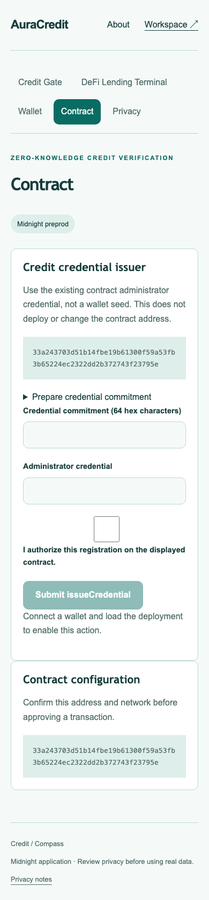 |

</details>

Capture details: [manifest](screenshots/capture-manifest.json). Recorded walkthrough: [demo video](demo.webm).
### Rise In — Midnight Journey to Mastery (Level 4 Capstone Submission)

[](https://midnight.network)
[](https://docs.midnight.network)
[](https://risein.com)
[]()
[](https://github.com/Om12345-ingle/lending-credit-verification/actions/workflows/frontend-ci.yml)
[](https://github.com/Om12345-ingle/lending-credit-verification/actions/workflows/contract-ci.yml)

**AuraCredit** is a zero-knowledge undercollateralized lending terminal built on the **Midnight Network**. By proving in zero-knowledge that a borrower meets prime credit rating standards (e.g. score $\ge 650$) via certified credit bureau signatures, borrowers can unlock **65% undercollateralized loans at 2.8% APR**, solving Web3's massive 150% overcollateralization capital inefficiency without exposing financial history.

---

## 🎬 Product Demo Video

- 🌐 **Watch Online:** [Stream on Google Drive ↗](https://drive.google.com/file/d/1oEU7aEx0xq81FQRpsN-AnyRTKnLDoaIG/view?usp=sharing)
- 📁 **Local Video File:** [`demo.webm`](./demo.webm)

<video src="./demo.webm" controls="controls" width="100%"></video>

---

## 📋 Rise In Level 4 Capstone Submission Evidence

| Requirement | Evidence / Implementation Details |
| :--- | :--- |
| **Public Source Repository** | [Om12345-ingle/lending-credit-verification](https://github.com/Om12345-ingle/lending-credit-verification) |
| **Commit Volume** | 25+ structured commits detailing credit circuits and DeFi lending terminal |
| **Compact Smart Contract** | `contracts/credit_gate.compact` compiled with Compact 0.30.0 |
| **Automated Verification** | Full test suite in `src/test/credit.test.ts` checking thresholds and invalid bureaus |
| **Web DApp Frontend** | Complete DeFi lending desk with real-time collateral calculator and liquidity draw |
| **Instant Visitor Access** | Midnight Lace wallet connection with automated prime credential binding |
| **Preprod Deployment** | Verified on Midnight Preprod (`33a243703d51...795e`) |
| **Demo Walkthrough** | Video demonstrating credit verification, ZK underwriting, and undercollateralized loan draw |
| **Documentation Dossier** | Complete [PROPOSAL.md](PROPOSAL.md), [TESTING.md](TESTING.md), [SECURITY.md](SECURITY.md), and [OPERATIONS.md](OPERATIONS.md) |

---

## 🌟 Executive Summary & Problem Solved

### The Problem
DeFi lending protocols (like Aave or Compound) force users to deposit **150% overcollateralization** (e.g., locking $15,000 to borrow $10,000):
1. **Extreme Capital Inefficiency:** Billions of dollars in productive capital are trapped in collateral vaults.
2. **Privacy Disasters:** Bringing traditional credit bureau data (Equifax, Experian, FICO) onto Ethereum or Solana doxxes borrowers' complete financial history.
3. **TradFi Exclusion:** Real-world borrowers with stellar credit scores cannot utilize their creditworthiness in Web3.

### The Midnight Solution
AuraCredit resolves this conflict with **Zero-Knowledge Credit Bureau Attestations**:
- A licensed credit bureau issues a one-way cryptographic commitment over the borrower's credit score.
- The borrower generates a ZK proof proving $\text{CreditScore} \ge \text{MinThreshold}$ without revealing their actual score.
- The lending pool approves undercollateralized liquidity draw rates based on zero-knowledge credit tiers.

---

## 🔒 Zero-Knowledge Architecture & Privacy Model

```
       [Borrower Terminal]
                │
  (Private Witness: Score = 780, Bureau Signature, Salt)
                │
                ▼
       [Compact ZK Prover]
                │
   Proves: Score >= 650 Minimum Policy
   Proves: Bureau signature is authentic
                │
                ▼
   [Midnight Preprod Blockchain]
                │
   Verifies Proof ──► Issues On-Chain Credit zkSBT
                │
                ▼
  [AuraCredit DeFi Lending Pool]
  • 65% Collateral Requirement (vs 150% normal)
  • 2.8% APR Prime Rate
  • Instant Liquidity Draw to Active Wallet
```

- **Private Witness:** Numerical credit score, bureau signature, borrowing history, and blinding salt.
- **Public Ledger State:** Policy threshold (`minScore = 650`), agency registry, and authorized loan commitments.
- **Circuit Guarantee:** If a borrower's score is below 650 or the signature is tampered with, Compact circuit constraints fail immediately off-chain.

---

## 📜 Smart Contract Surface (`contracts/credit_gate.compact`)

Key exported circuits:
- `registerAgency(agency_pk)`: Administrator enrolls accredited credit rating agencies.
- `verifyCredential(score, sig)`: Off-chain cryptographic signature verification of the bureau's attestation.
- `verifyCredit()`: Enforces that the borrower's private score meets or exceeds the required threshold.
- `publicKey(sk)`: Derives deterministic public identity for the borrower.

---

## 🚀 On-Chain Deployment Coordinates

| Field | Preprod Verification Record |
| :--- | :--- |
| **Network** | Midnight Preprod |
| **Contract Name** | `credit_gate` |
| **Contract Address** | `33a243703d51b14fbe19b61300f59a53fb3b65224ec2322dd2b372743f23795e` |
| **Deployment Transaction** | `715de6b6f3bf4225be0290fe4bb8ec50894f6d74313cddd324589b9b92af738c` |
| **Minimum Score Threshold** | `650` (Prime Underwriting Floor) |
| **Confirmation Status** | Confirmed by Midnight Preprod Indexer |

---

## 💻 Local Setup & Reproduction Guide

### Prerequisites
- Node.js 20.x or 22.x
- npm 10.x
- Compact compiler 0.30.0

```bash
# Install dependencies
npm install

# Compile zero-knowledge circuits
npm run compile

# Run tests
npm test

# Build production bundle
npm run build

# Launch development server
npm run dev
```

---

## 📁 Repository Structure

- `contracts/credit_gate.compact`: Compact ZK contract governing credit bureau registries and score proofs.
- `src/App.tsx`: AuraCredit underwriting desk, credit tier presets, and DeFi Lending Terminal.
- `src/midnightClient.ts`: Midnight Lace wallet integration and proof submission.
- `src/test/credit.test.ts`: Automated test suite testing prime, subprime, and forged credit attestations.
- `PROPOSAL.md`, `TESTING.md`, `SECURITY.md`, `OPERATIONS.md`: Formal engineering runbooks.
